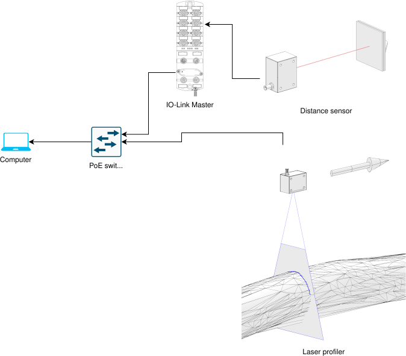
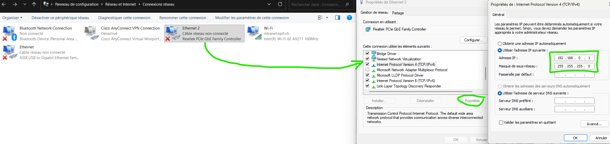
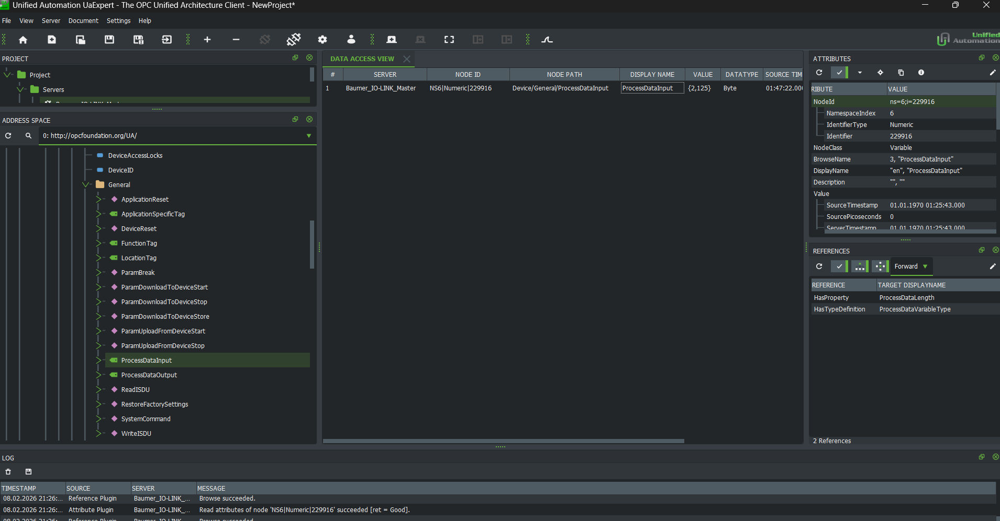

# profilerStreamer
profilerStreamer is a small project to combine 2D laser profiler data from Baumer with 1D sick distance sensor to recreate 3D point cloud of timber pieces in a CNC.

The hardware used in this instance is:

- [Baumer OXP200 profiler](https://www.baumer.com/ch/fr/apercu-des-produits/smart-vision/capteurs-de-profil/ox-laser-bleu/oxp200-b20c-004/p/46978)
- [Sick DT50-2B215252 distance sensor](https://www.sick.com/ch/en/catalog/products/distance-sensors/laser-distance-sensors/dx50-2/dt50-2b215252/p/p356454?tab=detail)

The setup is illustrated hereunder:
<center></center>

## Prerequisites

### Network setup
To communicate with the profiler's web socket and IO-Link master's OPC-UA server, connect your computer to local network (the one in which the profiler is present), which likely implies  connecting an ethernet cable. Then modify your computer's settings as follows:



Once this setup specified, you can turn the profiler and IO-Link master ON, and the connection should work fine.

### Identifiers and IPs
To run the code successfully, you must know:
- The IP adresses of:
    - the Baumer profiler
    - the IO-Link master

    [TO BE FIXED] For now hard-coded in the code:
    ```cpp
    std::string host = "192.168.0.251";
    //
    UA_Client *client = UA_Client_new();
    UA_StatusCode status = UA_Client_connect(client, "opc.tcp://192.168.0.64:4840");
    ```

- The NamespaceIndex and Identifier of the port 4 of the IO-Link device in the OPC-UA server of the IO-Link master.

    [TO BE FIXED] For now hard-coded in the code:
    ```cpp
    UA_NodeId processValueNodeId = UA_NODEID_NUMERIC(6, 229916)
    ```
    These parameters can be found using the [UaExpert software](https://www.unified-automation.com/):
    <center></center>


## Usage
The code developped here is intended to be developped into a grasshopper component. In the mean time, to use this code in its current form, you need a Windows computer with [git](https://git-scm.com/) and [cmake](https://cmake.org/) installed.
Run in a terminal in the root of this folder:
```bash
mrdir build
cd build
cmake .. -DCMAKE_BUILD_TYPE=Debug
cmake --build .
```
The second-to-last command will likely take some time the first time you run it because submodules will be initialized

Once the previous commands successfully run, you should have a `build/Debug` folder in which the executable is located, and 2 OXAPI<...>.dll in the `build` folder. At that point you can execute the code from the build folder:
```bash
.\Debug\profilerStreamer.exe
```